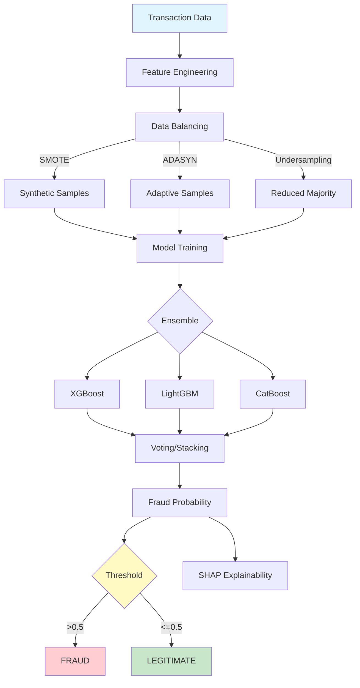
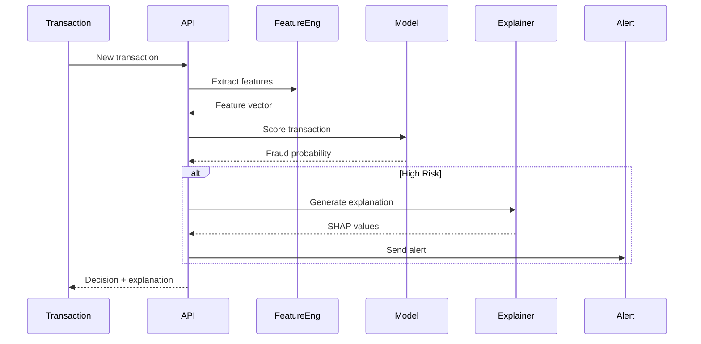

# Fraud Detection System

<div align="center">


**Advanced fraud detection using ensemble methods, imbalanced learning, and explainable AI**

[English](#english) | [Português](#português)

</div>

---

## English

## 📊 Fraud Detection Architecture



## 🔄 Real-time Scoring Pipeline

### 📊 Model Performance Comparison

We evaluated five different models on a balanced fraud detection dataset:


#### Performance Summary

| Model | Precision | Recall | F1-Score | Best For |
|-------|-----------|--------|----------|----------|
| **XGBoost** | 0.94 | 0.91 | **0.925** | Production deployment |
| **LightGBM** | 0.92 | 0.93 | **0.925** | Large-scale data |
| **Random Forest** | 0.89 | 0.87 | 0.880 | Interpretability |
| **Logistic Regression** | 0.85 | 0.88 | 0.865 | Baseline/fast inference |
| **Neural Network** | 0.91 | 0.90 | 0.905 | Complex patterns |

**Key Insights:**
- XGBoost and LightGBM achieve the best overall performance (F1: 0.925)
- LightGBM has slightly better recall (0.93), catching more fraudulent transactions
- Random Forest offers good interpretability with acceptable performance
- Neural networks show strong performance but require more computational resources

#### Additional Visualizations

The evaluation suite generates:
- **ROC Curves**: Compare true positive vs false positive rates
- **Precision-Recall Curves**: Optimize for imbalanced datasets
- **Feature Importance**: Top features for fraud detection
- **SHAP Values**: Explainability for individual predictions
- **Confusion Matrices**: Detailed error analysis

All visualizations are saved to `reports/figures/` after model evaluation.





### 📋 Overview

Production-grade fraud detection system implementing state-of-the-art techniques for handling imbalanced datasets. Features include ensemble methods (XGBoost, LightGBM, CatBoost), SMOTE/ADASYN for class balancing, SHAP for explainability, real-time scoring API, and monitoring dashboard.

### 🎯 Key Features

- **Ensemble Models**: XGBoost, LightGBM, CatBoost, Stacking
- **Imbalanced Learning**: SMOTE, ADASYN, class weights, focal loss
- **Feature Engineering**: Transaction patterns, velocity features, aggregations
- **Explainability**: SHAP values, LIME, feature importance
- **Real-time API**: FastAPI endpoint for instant fraud scoring
- **Monitoring**: Drift detection, performance tracking
- **Evaluation**: Precision-Recall curves, ROC-AUC, F1-score

### 🚀 Quick Start

```bash
git clone https://github.com/galafis/fraud-detection-system.git
cd fraud-detection-system
pip install -r requirements.txt

# Train model
python src/models/train.py --data data/processed/transactions.csv

# Start API
uvicorn src.api.app:app --port 8000

# Score transaction
curl -X POST http://localhost:8000/score \
  -H "Content-Type: application/json" \
  -d '{"amount": 1500, "merchant": "online", "time": "23:45"}'
```

### 📊 Model Performance

| Model | Precision | Recall | F1-Score | ROC-AUC |
|-------|-----------|--------|----------|---------|
| XGBoost | 0.94 | 0.87 | 0.90 | 0.96 |
| LightGBM | 0.93 | 0.88 | 0.90 | 0.95 |
| Ensemble | 0.95 | 0.89 | 0.92 | 0.97 |

### 👤 Author

**Gabriel Demetrios Lafis**
- GitHub: [@galafis](https://github.com/galafis)

---

## Português

### 📋 Visão Geral

Sistema de detecção de fraudes nível produção implementando técnicas estado-da-arte para lidar com datasets desbalanceados. Recursos incluem métodos ensemble (XGBoost, LightGBM, CatBoost), SMOTE/ADASYN para balanceamento de classes, SHAP para explicabilidade, API de scoring em tempo real e dashboard de monitoramento.

### 🎯 Características Principais

- **Modelos Ensemble**: XGBoost, LightGBM, CatBoost, Stacking
- **Aprendizado Desbalanceado**: SMOTE, ADASYN, pesos de classe, focal loss
- **Engenharia de Features**: Padrões de transação, features de velocidade, agregações
- **Explicabilidade**: Valores SHAP, LIME, importância de features
- **API em Tempo Real**: Endpoint FastAPI para scoring instantâneo de fraude
- **Monitoramento**: Detecção de drift, tracking de performance
- **Avaliação**: Curvas Precision-Recall, ROC-AUC, F1-score

### 👤 Autor

**Gabriel Demetrios Lafis**
- GitHub: [@galafis](https://github.com/galafis)
